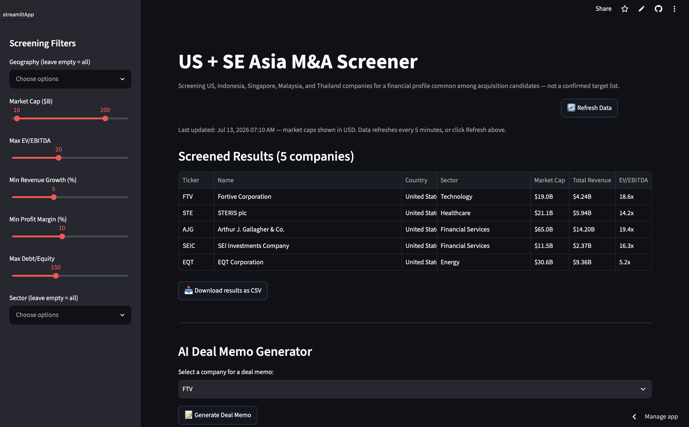
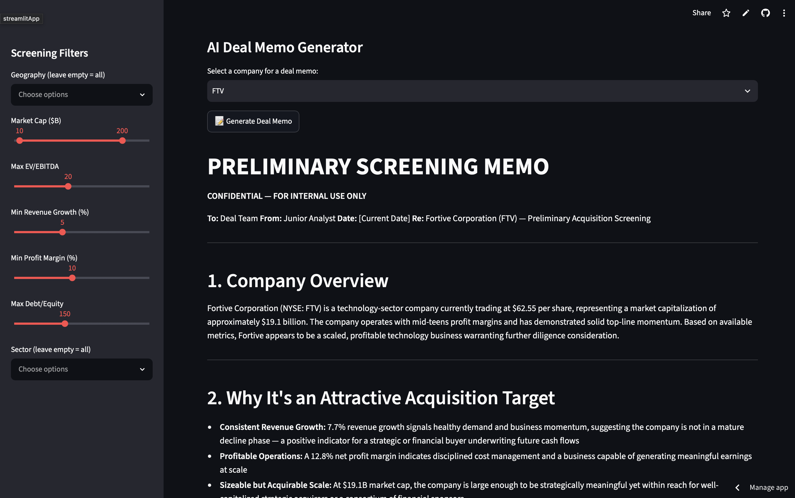

# US + SE Asia M&A Screener

**Live app:** [edric-ma-screener.streamlit.app](https://edric-ma-screener.streamlit.app)

A cross-border M&A screening tool covering the US, Indonesia, Singapore, Malaysia, and Thailand, with an AI-generated preliminary deal memo for any company that clears the filters.

## Why I built this

Most screening tools stop at the US or treat Southeast Asia as an afterthought. I wanted something that covers both — screening for companies with a financial profile common among acquisition candidates (reasonable valuation, growth, manageable leverage) across five markets, with currency-adjusted comparisons so a $2B Indonesian company and a $2B US company are actually being compared on equal footing.

## What it does

- Screens 35+ companies across five markets on market cap, total revenue, EV/EBITDA, revenue growth, profit margin, and debt/equity
- Converts every market cap and revenue figure to USD using live FX rates, since SE Asia figures come back in local currency
- Filters by geography and sector
- Generates a preliminary screening memo (company overview, why it's attractive, key risks, valuation range) via the Claude API for any company in the filtered results
- Exports results as CSV

## Screenshots




## Tech stack

Python, Pandas, Streamlit, yFinance, Claude API (Anthropic)

## Limitations

- Data refreshes every 5 minutes; market fundamentals like EV/EBITDA don't move meaningfully within that window, but live share prices may lag slightly
- Philippines (PSE) is excluded — no reliable free data source found via yFinance
- The AI-generated memo is a first-pass draft based only on the metrics shown; it is not a substitute for real diligence, filings review, or comparable transaction analysis
- "Screened" means a company fits a common financial profile for acquisition candidates — not that it is an actual, confirmed target

## Running locally

```bash
pip install -r requirements.txt
```

Create `.streamlit/secrets.toml`:
```toml
ANTHROPIC_API_KEY = "your-key-here"
```

Then run:
```bash
streamlit run app.py
```
